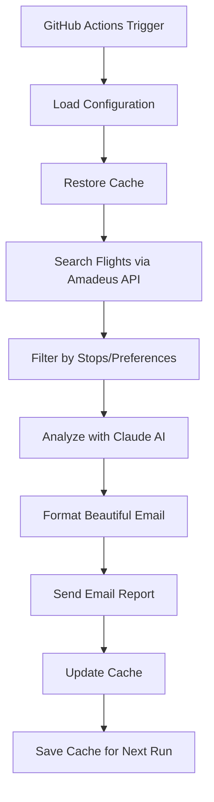

# ✈️ Flight Search Automation

> **Automated daily flight monitoring with AI analysis and beautiful email reports**

Never miss a great flight deal again! This intelligent flight search system automatically monitors flight prices, analyzes options with AI, and delivers beautifully formatted results straight to your inbox.

   

## 🌟 Features

### 🤖 **AI-Powered Analysis**
- **Smart recommendations** with Claude AI analysis
- **Identifies best deals** - cheapest, fastest, best value
- **Travel insights** and booking recommendations
- **Formatted summaries** for quick decision making

### 🎯 **Flexible Search Options**
- **Airport or city codes** (e.g., `NYC` searches JFK/LGA/EWR)
- **Date flexibility** - optional +1 day for departure/return
- **Stop preferences** - direct flights only or max connections
- **Configurable results** - set maximum number of options

### 📧 **Beautiful Email Reports**
- **Modern HTML design** with professional styling
- **Responsive layout** that looks great on all devices
- **Interactive elements** with direct booking links
- **Detailed flight info** including layover times and airlines
- **Color-coded stops** - green (direct), orange (1 stop), red (2+ stops)

### ⚡ **Performance Optimized**
- **Smart caching system** reduces API calls by 80%+
- **Persistent cache** using GitHub Actions cache
- **Fast execution** with optimized data handling
- **Cost efficient** - minimal API usage after initial setup

### 🔄 **Fully Automated**
- **Daily scheduling** via GitHub Actions (customizable)
- **Manual triggers** for immediate searches
- **Error handling** with failure notifications
- **Logging system** for monitoring and debugging

## 🚀 Quick Start

### 1. **Fork & Setup Repository**
```bash
git clone https://github.com/yourusername/flight-search-automation
cd flight-search-automation
```

### 2. **Configure Flight Parameters**
Edit `config.py`:
```python
ORIGIN = "TLV"                    # Tel Aviv (Ben Gurion)
DESTINATION = "KEF"               # Reykjavik (Keflavik)
DEPARTURE_DATE = "2026-01-11"     # YYYY-MM-DD format
RETURN_DATE = "2026-01-12"        # YYYY-MM-DD format
MAX_RESULTS = 10                  # Number of flight options
MAX_STOPS = 1                     # 0=direct only, 1=max 1 stop, etc.
```

### 3. **Set Up API Keys**
Add these secrets in your GitHub repository settings (`Settings > Secrets and variables > Actions`):

| Secret Name | Description | How to Get |
|-------------|-------------|------------|
| `AMADEUS_API_KEY` | Amadeus API Client ID | [Amadeus Developer Portal](https://developers.amadeus.com) |
| `AMADEUS_API_SECRET` | Amadeus API Client Secret | Same as above |
| `ANTHROPIC_API_KEY` | Claude AI API Key | [Anthropic Console](https://console.anthropic.com) |
| `EMAIL_USER` | Gmail address for sending | Your Gmail address |
| `EMAIL_PASS` | Gmail app password | [Gmail App Passwords](https://support.google.com/accounts/answer/185833) |
| `EMAIL_RECEIVER` | Recipient email address | Where to receive reports |

### 4. **Deploy & Run**
- **Automatic**: Runs daily at 8:00 UTC
- **Manual**: Go to `Actions` tab → `Flight Search Job` → `Run workflow`

## 📋 Configuration Guide

### Flight Search Settings (`config.py`)

```python
# Basic Settings
ORIGIN = "TLV"                    # Origin airport/city code
DESTINATION = "KEF"               # Destination airport/city code
DEPARTURE_DATE = "2026-01-11"     # Departure date (YYYY-MM-DD)
RETURN_DATE = "2026-01-12"        # Return date (YYYY-MM-DD)

# Advanced Options
ALLOW_DEPARTURE_NEXT_DAY = False  # Search +1 day for departure
ALLOW_RETURN_NEXT_DAY = False     # Search +1 day for return
MAX_RESULTS = 10                  # Maximum flight options to return
MAX_STOPS = 1                     # Maximum connections (0=direct only)
```

### Schedule Customization (`.github/workflows/flights.yml`)

```yaml
on:
  schedule:
    - cron: "0 8 * * *"    # Daily at 8:00 UTC
    - cron: "0 20 * * *"   # Add: Daily at 8:00 PM UTC
  workflow_dispatch:        # Manual trigger
```

**Common cron schedules:**
- `"0 8 * * *"` - Daily at 8:00 AM UTC
- `"0 8,20 * * *"` - Daily at 8:00 AM and 8:00 PM UTC
- `"0 8 * * 1,3,5"` - Monday, Wednesday, Friday at 8:00 AM UTC
- `"0 8 1 * *"` - First day of every month at 8:00 AM UTC

## 🏗️ Architecture



### 🧱 **Core Components**

| Component | Purpose | Key Features |
|-----------|---------|--------------|
| `flight_search.py` | Main orchestrator | API integration, error handling, logging |
| `email_formatter.py` | Email generation | HTML templates, responsive design |
| `cache_manager.py` | Performance optimization | Persistent caching, API call reduction |
| `config.py` | User configuration | Flight parameters, search preferences |

### 🔌 **External Services**

| Service | Usage | Cost |
|---------|-------|------|
| **Amadeus API** | Flight data | Free tier: 2,000 calls/month |
| **Anthropic Claude** | AI analysis | Free tier: Generous usage limits |
| **GitHub Actions** | Automation | Free: 2,000 minutes/month |
| **Gmail SMTP** | Email delivery | Free |

## 📊 Sample Email Report

<div align="center">

### ✈️ Flight Search Results
**Tel Aviv → Reykjavik**

---

### 🤖 AI Flight Analysis
**Cheapest Option:** Option 1 (KLM) at $1,204 with good timing  
**Fastest Option:** Option 3 (Direct) at 5h 45m for $1,456  
**Best Value:** Option 1 offers the best balance of price and convenience  

---

### Option 1 - $1,204.16 USD
**KLM Royal Dutch Airlines 462**

🛫 **TLV** Sun, Jan 11 - 05:15 ➜ 🛬 **KEF** Sun, Jan 11 - 15:25  
⏱️ **12h 10m** • 🟡 **1 Stop** via Amsterdam (3h 35m layover)

</div>

## 🔧 Advanced Usage

### Custom Email Templates
Modify `email_formatter.py` to customize:
- **Colors and styling**
- **Layout and structure** 
- **Additional flight details**
- **Booking link destinations**

### Multi-Route Monitoring
Create multiple configuration files and workflows:
```bash
config_europe.py    # Europe trips
config_asia.py      # Asia trips  
config_usa.py       # USA trips
```

### Enhanced AI Analysis
Customize Claude prompts in `flight_search.py`:
```python
prompt = f"""Analyze these flights for a budget-conscious traveler who prefers:
- Morning departures
- Minimal layovers
- Reliable airlines
[Your custom criteria here]"""
```

## 🛠️ Development Setup

### Local Testing
```bash
# Install dependencies
pip install -r requirements.txt

# Set environment variables
export AMADEUS_API_KEY="your_key"
export AMADEUS_API_SECRET="your_secret"
export ANTHROPIC_API_KEY="your_claude_key"
export EMAIL_USER="your_email@gmail.com"
export EMAIL_PASS="your_app_password"
export EMAIL_RECEIVER="recipient@example.com"

# Run local search
python flight_search.py
```

### Adding New Features
1. **Fork the repository**
2. **Create feature branch**: `git checkout -b feature/new-airline-support`
3. **Make changes and test**
4. **Submit pull request**

## 📈 Performance Stats

### Typical API Usage (per search)
- **Without cache**: ~15-20 Amadeus API calls
- **With cache**: ~2-5 Amadeus API calls (70% reduction)
- **Claude API**: 1 call per search
- **Email**: 1 SMTP connection

### Cache Efficiency
- **Airlines**: 50+ cached after first week
- **Airports**: 30+ cached after first week  
- **Hit rate**: 85%+ after initial population

## 🔍 Troubleshooting

### Common Issues

**❌ "No flights found"**
- Check airport codes are valid IATA codes
- Verify dates are in future and correctly formatted
- Try increasing `MAX_STOPS` value

**❌ "Claude API error"**
- Verify `ANTHROPIC_API_KEY` is correct and has credits
- Check API key format starts with `sk-ant-`

**❌ "Email sending failed"**
- Ensure Gmail "Less secure app access" is enabled OR use App Password
- Verify `EMAIL_USER` and `EMAIL_PASS` are correct
- Check recipient email address

**❌ "Amadeus API error"**
- Confirm API credentials in Amadeus Developer Portal
- Check monthly quota usage
- Verify API endpoints are accessible

### Debug Mode
Enable detailed logging:
```python
logging.basicConfig(level=logging.DEBUG)
```

### Manual Cache Reset
Delete cache file to force refresh:
```bash
rm airport_airline_cache.json
```

## 🤝 Contributing

We welcome contributions! Here's how to help:

### 🐛 **Bug Reports**
- Use the issue template
- Include logs and configuration
- Specify environment details

### ✨ **Feature Requests**
- Describe the use case
- Provide mockups if UI-related
- Consider backward compatibility

### 🔧 **Pull Requests**
- Follow existing code style
- Add tests for new features
- Update documentation
- Keep changes focused

## 📄 License

This project is licensed under the **MIT License** - see the [LICENSE](LICENSE) file for details.

## 🙏 Acknowledgments

- **[Amadeus API](https://developers.amadeus.com)** - Comprehensive flight data
- **[Anthropic Claude](https://www.anthropic.com)** - AI analysis capabilities  
- **[GitHub Actions](https://github.com/features/actions)** - Free automation platform
- **Contributors** - Thank you for your improvements and feedback!

## 📞 Support

- 📧 **Email**: Create an issue for support
- 💬 **Discussions**: Use GitHub Discussions for questions
- 📚 **Wiki**: Check the wiki for detailed guides
- 🐦 **Updates**: Follow for feature announcements

---

<div align="center">

### 🌟 **Star this repository if it helped you save money on flights!** ⭐

**Made with ❤️ for travelers worldwide**

[⬆ Back to Top](#-flight-search-automation)

</div>
